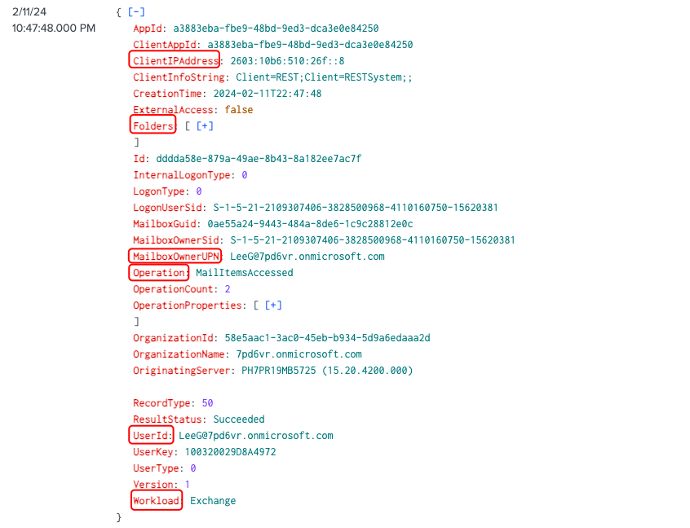
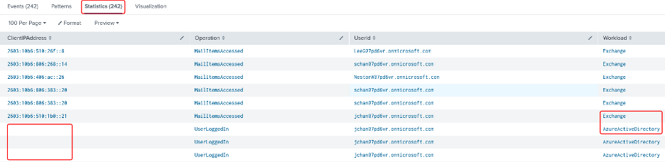
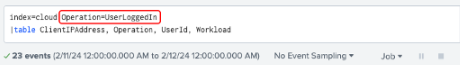
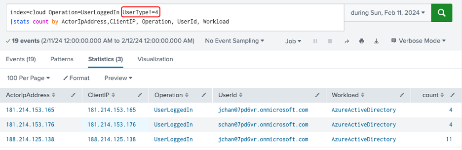
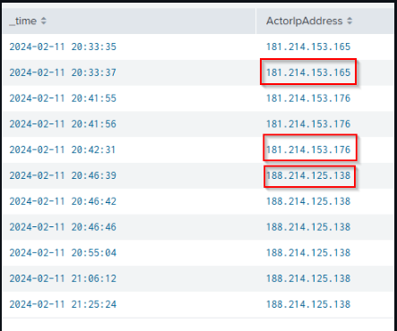
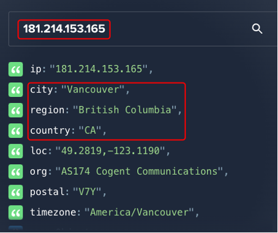
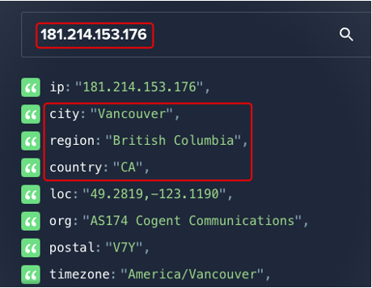
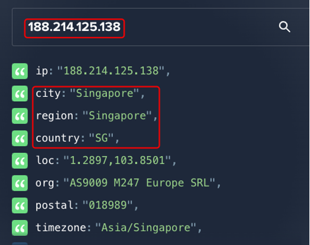
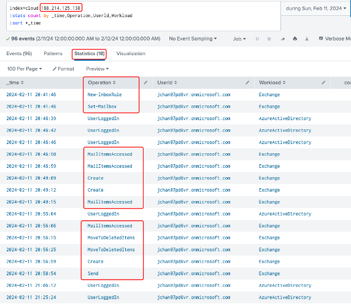

# Identity Compromise Investigation: Impossible Travel & Unfamiliar Sign-In

## Objective

Conducted an investigation using Splunk and Microsoft 365 Audit Logs to identify potential account compromises by detecting impossible travel and unfamiliar sign-in activities.

## How I Conducted the Investigation

### 1. Key Fields Selection

Initially, I reviewed the audit logs to identify key fields essential for the investigation. The fields selected included:

* `ClientIPAddress`
* `Operation`
* `UserId`
* `Workload`

**Query**: index=cloud | table ClientIPAddress, Operation, UserId, Workload  

**We have 242 Events  combining both Exchange and Active Directory workloads**

  

### 2. Reviewing Audit Logs

I started by accessing the Microsoft 365 Unified Audit Logs through Splunk, focusing specifically on user login events (`Operation=UserLoggedIn`). This allowed me to quickly identify relevant log entries.

Now we narrowed down the events from 242 to just 23 !!

Query: index=cloud Operation=UserLoggedIn | table ClientIPAddress, Operation, UserId, Workload  

### 3. Removing Non-User Entries

To make my analysis accurate, I filtered out any system-generated logs (`UserType!=4`) so I could concentrate solely on user-related activities.

Query: index=cloud Operation=UserLoggedIn UserType!=4 | stats count by _time,ActorIpAddress,ClientIP, Operation, UserId, Workload  

### 4. Checking IP Addresses

Discovered 3 IP addresses related to Operation=UserLoggedIn

  

### Next i conducted some OSINT on the ip addresses using a site called ipinfo.io, Upon checking the geolocation my observations are :

**IP '181.214.153.165' user 'schan' logged in from Vancouver, Canada** 

**IP '181.214.153.176' user 'jchan' logged in from Vancouver, Canada** 

**IP '188.214.125.138' user 'jchan' logged in from singapore** 

**Upon analyzing we can clearly see that user 'jchan' Logged in from canada and right after 13 minutes he logged in from singapore
This scenario from user 'jchan' indicated potential impossible travel and raised immediate security concerns.**  

### 5. Detecting Malicious Operations

Digging deeper, I analyzed activities associated with the suspicious Singapore IP (188.214.125.138). I identified several distinct malicious mailbox operations:

* **New-InboxRule:** Created a mailbox rule forwarding emails from internal users to external emails
* **MailItemAccessed:** Accessed multiple sensitive emails.
* **MovedTodeletedItems:** Deleted critical draft emails.
* **Send:** Sent targeted phishing emails to clients.  

## 6. Summary of Investigation

* **Compromised Account:** `jchan@7pd6vr.onmicrosoft.com`
* **Suspicious IP Address:** 188.214.125.138 (Singapore)
* **Malicious Activities Detected:**

  * Created unauthorized email forwarding rules.
  * Accessed and deleted sensitive emails.
  * Sent targeted phishing emails.  

## 7. Recommended Actions

* Immediately reset credentials and revoke active sessions for the compromised account.
* Remove unauthorized email forwarding rules and mailbox settings.
* Conduct comprehensive searches to find additional indicators of compromise.
* Strengthen security monitoring and implement alerts for impossible travel and unusual login activities.  

## Tools Used

* **Splunk:** Used for comprehensive log analysis and event correlation.
* **Microsoft 365 Audit Logs:** Provided detailed insights into user actions.
* **ipinfo.io:** Assisted in IP address geolocation and threat assessment.

---

This hands-on investigative approach demonstrates my capabilities in effectively handling security incidents, conducting detailed log analyses, and swiftly responding to cybersecurity threats.
