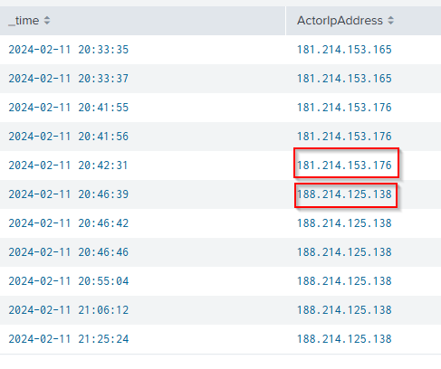

# Identity Compromise Investigation: Impossible Travel & Unfamiliar Sign-In

## Objective

Conducted an investigation using Splunk and Microsoft 365 Audit Logs to identify potential account compromises by detecting impossible travel and unfamiliar sign-in activities.

## How I Conducted the Investigation

### Step 1: Key Fields Selection

Initially, I reviewed the audit logs to identify key fields essential for the investigation. The fields selected included:

* `ClientIPAddress`
* `Operation`
* `UserId`
* `Workload`

*Screenshot 1: Key Fields.*

**Query**: index=cloud | table ClientIPAddress, Operation, UserId, Workload  

**We have 242 Events  combining both Exchange and Active Directory workloads**

*Screenshot 3: 242 Events.*

### Step 2: Reviewing Audit Logs

I started by accessing the Microsoft 365 Unified Audit Logs through Splunk, focusing specifically on user login events (`Operation=UserLoggedIn`). This allowed me to quickly identify relevant log entries.

*Screenshot 2: Searching Operation=UserLoggedIn.*

Now we narrowed down the events from 242 to just 23 !!

Query: index=cloud Operation=UserLoggedIn | table ClientIPAddress, Operation, UserId, Workload

### Step 3: Removing Non-User Entries

To make my analysis accurate, I filtered out any system-generated logs (`UserType!=4`) so I could concentrate solely on user-related activities.

*Screenshot 2: Filtering Out System Generated Logs.*

Query: index=cloud Operation=UserLoggedIn UserType!=4 | stats count by _time,ActorIpAddress,ClientIP, Operation, UserId, Workload

### Step 4: Checking IP Addresses

Discovered 2 IP addresses related to Operation=UserLoggedIn

*Screenshot 2: IP addresses related to UserLoggedIn.*  

Next i conducted some OSINT on the ip addresses using a site called ipinfo.io, Upon checking the geolocation my observations are :

IP '181.214.153.165' user 'schan' logged in from Vancouver, Canada

IP '181.214.153.176' user 'jchan' logged in from Vancouver, Canada

IP '188.214.125.138' user 'jchan' logged in from singapore 

Upon analyzing we can clearly see that user 'jchan' Logged in from canada and right after 13 minutes he logged in from singapore
This scenario from user 'jchan' indicated potential impossible travel and raised immediate security concerns.

### Step 5: Detecting Impossible Travel

Digging deeper, I analyzed activities associated with the suspicious Singapore IP (188.214.125.138). I identified several distinct malicious mailbox operations:

* **Unauthorized Email Forwarding Rule:** Created a mailbox rule forwarding emails from internal user `schan` to an external email (`stoicellis@imcourageous.com`). Emails were automatically marked as read and moved to the Deleted Items folder.
* **Email Access:** Accessed multiple sensitive emails, particularly focusing on drafts.
* **Email Deletion:** Deleted critical draft emails, notably targeting sensitive financial information.
* **Sending Malicious Emails:** Sent targeted phishing emails, including one titled "URGENT: Client Bank Account" with a malicious attachment (`NEW-BANK-ACCOUNT.pdf`).

### Step 7: Identifying Sensitive Email Access

Further investigation revealed specific sensitive emails accessed by the attacker, including:

* Draft titled "RE: First Invoice of the month!"
* Draft titled "URGENT: Client Bank Account"

## Summary of Investigation

* **Compromised Account:** `jchan@7pd6vr.onmicrosoft.com`
* **Suspicious IP Address:** 188.214.125.138 (Singapore)
* **Malicious Activities Detected:**

  * Created unauthorized email forwarding rules.
  * Accessed and deleted sensitive draft emails.
  * Sent targeted phishing emails containing malicious attachments.

## Recommended Actions

* Immediately reset credentials and revoke active sessions for the compromised account.
* Remove unauthorized email forwarding rules and mailbox settings.
* Conduct comprehensive searches to find additional indicators of compromise.
* Strengthen security monitoring and implement alerts for impossible travel and unusual login activities.

## Tools Used

* **Splunk:** Used for comprehensive log analysis and event correlation.
* **Microsoft 365 Audit Logs:** Provided detailed insights into user actions.
* **ipinfo.io:** Assisted in IP address geolocation and threat assessment.

---

This hands-on investigative approach demonstrates my capabilities in effectively handling security incidents, conducting detailed log analyses, and swiftly responding to cybersecurity threats.
